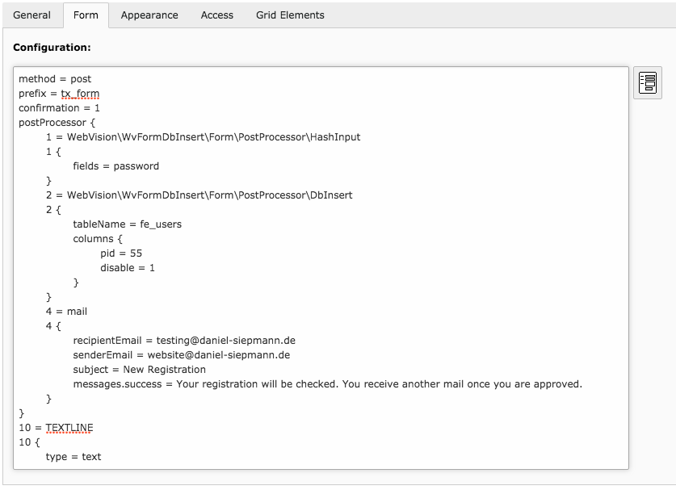

.. include:: Includes.txt

.. _usage:

Usage
=====

As this extension just provides further post processors to use with TYPO3 native Form element, all
you have to do is to add the necessary configuration to the form configuration. Open the content
element containing the form, and add the post processor.

Currently the wizard is not supported, so you have to write the configuration
yourself. E.g.:

.. literalinclude:: Examples/full.ts
   :language: typoscript
   :lines: 1-17, 26

In context, it will look like:

The configuration will not be removed while using the wizard.

To allow the post processor to insert values, the field names of form and database table have to
match. There is no option to define a mapping.

To find out how to configure the post processors and which are available, take a look at the
:ref:`configuration`.
